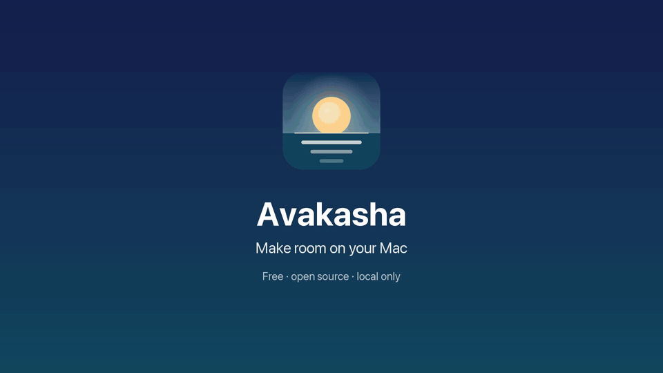
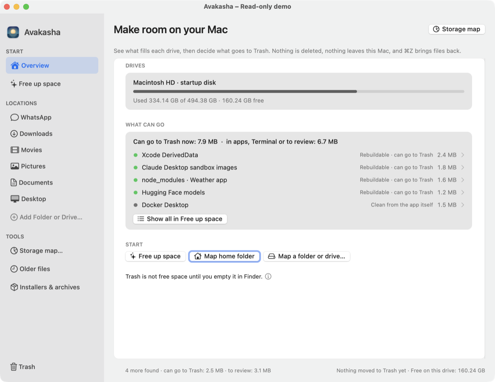
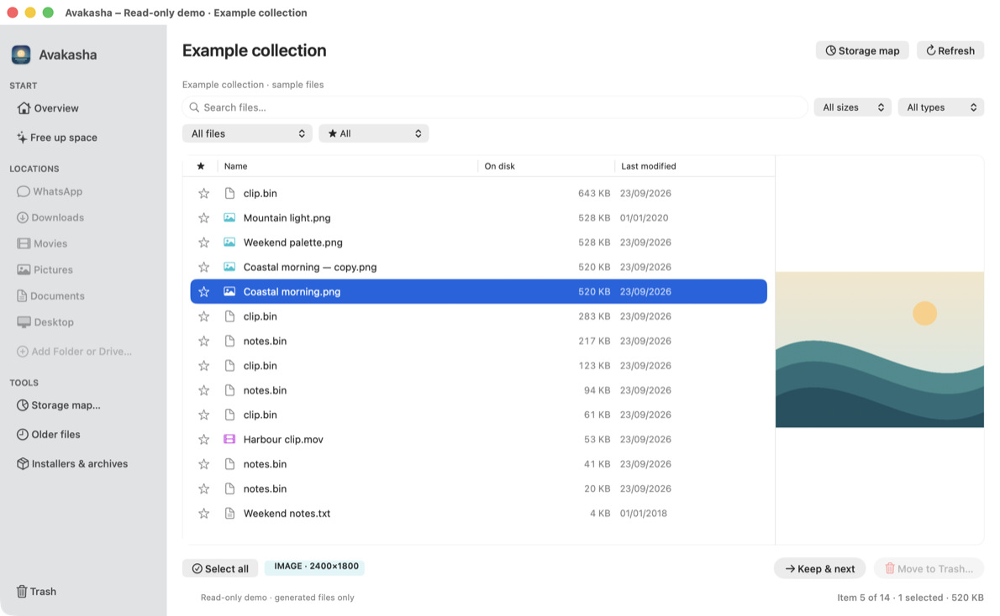
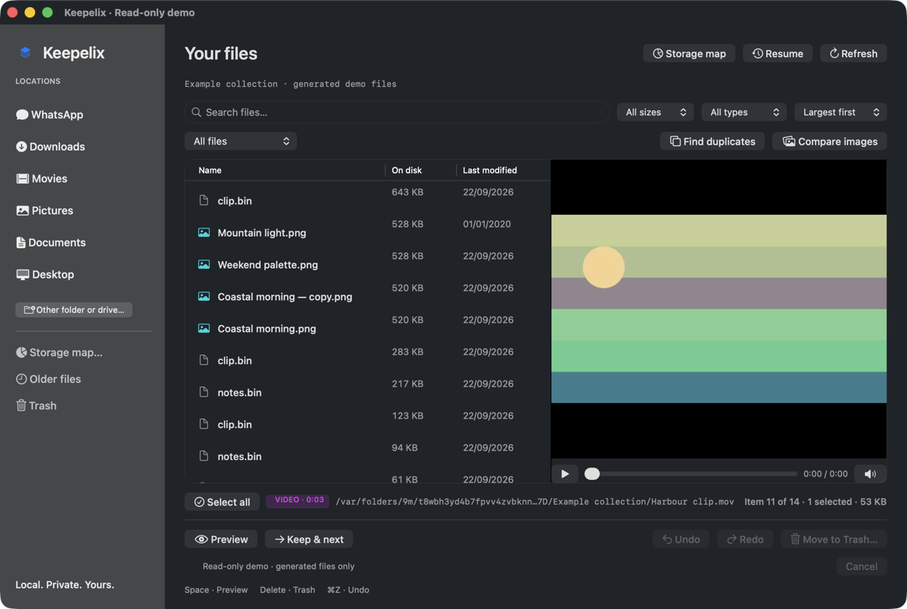
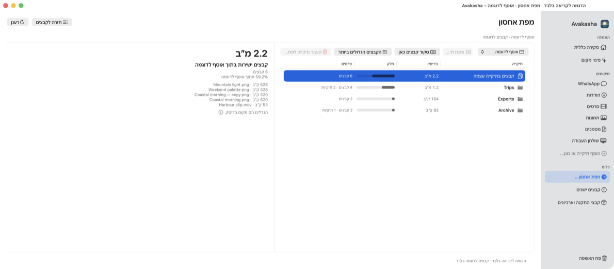
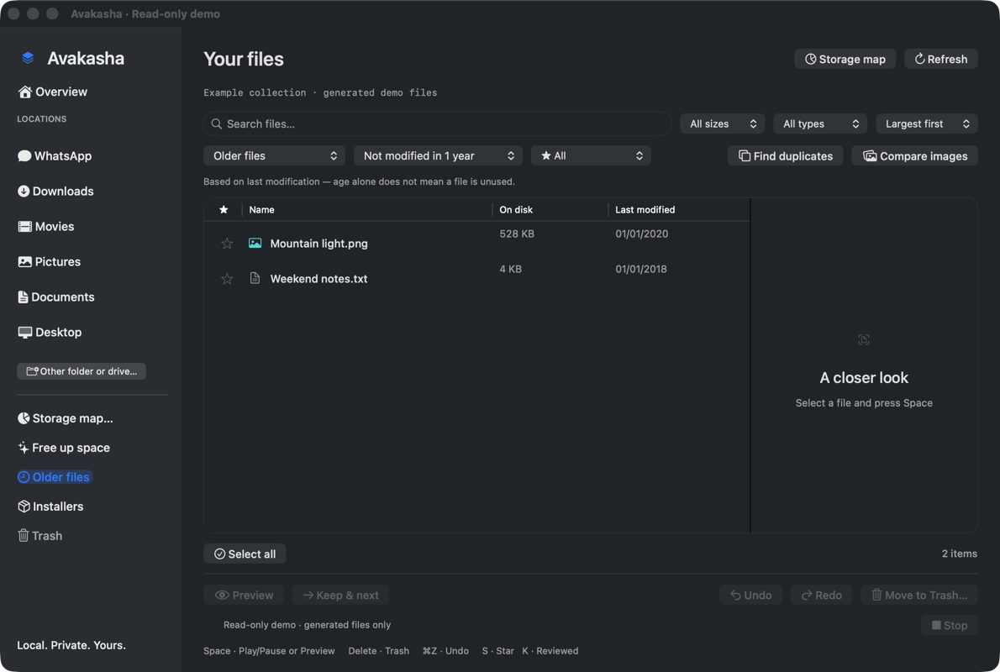

<p align="center"></p>

<p align="center">
  <a href="https://github.com/danielsimisi-coder/avakasha/actions/workflows/ci.yml"></a>
  
  <a href="LICENSE"></a>
  
</p>

<p align="center"><strong>Avakasha (Sanskrit avakāśa: room, open space) makes room on your Mac.</strong><br>See what fills it, review it with your eyes and your keyboard, and decide what stays.<br>Map a folder or drive. Open the folder that takes the space. Preview each file. Keep it or move it to Trash. Continue.</p>

<p align="center"><a href="https://github.com/danielsimisi-coder/avakasha/releases">Releases</a> · <a href="docs/DISTRIBUTION.md">Build from source</a> · <a href="docs/PRIVACY.md">Privacy</a> · <a href="docs/SAFETY.md">Safety</a></p>

## Your Mac is full. But full of what?

Avakasha was born from a recurring frustration: **storage keeps filling up, you do not know where the space has gone, and the Mac’s built-in tools do not give you a clear, convenient way to work through the problem.**

A storage total tells you that you have a problem. A folder full of unfamiliar filenames still leaves the hard part: finding the large files, seeing what they actually contain, and deciding what you can let go of without losing something important.

The first pile we tackled was accumulated WhatsApp media: old videos, repeated images and forgotten attachments mixed with useful files and client material. But WhatsApp was one example of the broader problem. Downloads, Movies and external drives can build up the same way.

Avakasha makes the review practical. Choose a folder or drive, sort by size, and work through the files: **Space to preview, Delete to move to Trash, ↓ to continue.** Older-file filters and duplicate suggestions help narrow the pile; Undo helps recover from a mistaken move. You decide what matters.

**No WhatsApp account connection. No cloud analysis. No automatic permanent deletion.** Avakasha reviews your chosen location; it does not read conversations or identify client files.

In one sentence: Avakasha is a Mac app that helps you free up space by showing what is actually filling your computer, from WhatsApp media to Downloads, Movies and external drives, so you can see it and decide what stays.

**Overview.** The app opens on an overview: each local disk with used, total and free space and a share bar, what this session has moved to Trash so far, and three ways to start (map the home folder, map a folder or drive, open Trash in Finder). The numbers come from volume attributes only; nothing inside a volume is listed until you choose a location. Free space is what you can still write, so Trash does not count as free until you empty it. The sidebar highlights the view you are in: Overview, Storage map, Free up space, Older files, Installers or the loaded location.



## Where is the space?


Click **Storage map…** in the sidebar and choose a folder or a drive (your home folder is a good start). Avakasha measures every folder below it and lists them largest first, with a share bar and notes. Open a folder to go deeper; press **Review files here** to switch to the file review of that folder, sorted by size. **Back to files** returns to the list, and **Storage map** in the header jumps back to the map at the folder you are reviewing, without measuring again. After you move or restore files the map shows a **Rescan** button and says its numbers are out of date; Refresh in the header does the same.

**Largest files** in the map toolbar hands the largest files found anywhere under the mapped folder (up to 200, the same read-only rules as file review: no bundle contents, hidden files, cloud placeholders or app databases) to file review as one list, largest first, with the mapped folder as the review root. The folder label reads "path · largest files" and the status line says how many were listed. The map's details pane also names up to five files inside the highlighted folder that are among the mapped folder's 200 largest, or among the loose files of the current folder; a folder with none of them shows no list. Older files and Installers in this view filter only the listed largest files; choose the location in the sidebar for the full folder. Refresh in this view measures the map again and rebuilds the list; clicking the same location in the sidebar starts a full scan instead. Return on the "Files in this folder" row reviews that folder, like Review files here.

Measuring is read-only: the map reads names, sizes and flags and never opens file contents. It reports what it could not measure instead of guessing:

- **Not accessible** folders (permissions or protected locations) are listed with a lock and counted separately.
- **Bundles** such as apps and photo libraries are measured but not opened file by file.
- **Hidden** folders are shown, because system and app data often live there. Review them with care.
- **Cloud placeholders** that are not downloaded take no local space and are counted separately.
- Symbolic links are not followed, other volumes mounted below the folder are not entered, and hard-linked data is counted once.
- You can cancel a long measurement and keep the partial totals; the map says they are partial.

Sizes are space allocated on disk. Hard links, APFS clones, snapshots and cloud placeholders mean that moving files to Trash may free a different amount, and Trash itself is not free space until you empty it.

**Move a whole folder.** Select a subfolder in the map and press **Delete** or the red **Move folder to Trash…** button. The button stays disabled for the mapped root itself, bundles, hidden folders, folders that could not be read and folders with unmeasured items. The flow is always the same: Avakasha checks the folder (strictly inside the mapped root, not a symbolic link, package, hidden or cloud placeholder), measures it again right now, and refuses if that fresh measurement holds anything it could not count (not accessible, not downloaded, or on another volume). Then it asks. This confirmation shows the fresh size, file and folder counts and the path, and it is shown every time, even when you turned off the confirmation for file moves. The folder goes to Trash as one item, only if it is still the same folder (device, inode and unchanged modification time) that was just measured; if it changed in between, nothing moves. The row leaves the map and the map is marked out of date. **⌘Z** brings the folder back while the map is shown, as long as nothing else occupies its original path; a blocked restore waits under **Retry restore**. **Redo is not available for folders.**

**What about “Other” or “System Data”?** macOS puts caches, app data, backups and hidden Library folders into that bucket. Avakasha does not delete it for you. Map your home folder and the hidden folders appear with their real sizes, so you can see what is in there and review the files you recognise. Protected system folders are reported as not accessible rather than guessed. **Free up space** in the sidebar explains the usual suspects one by one.

## Free up space

Click **Free up space** in the sidebar. Avakasha lists the places from a built-in catalogue that exist on this Mac (mostly in your home folder; also your Trash and the system temporary folders, listed so their size is visible): Xcode simulators, DerivedData, device support files and archives, OrbStack and Docker data, package caches (npm, pnpm, Yarn, Homebrew, pip, Go, Gradle, Maven, CocoaPods, Cargo), AI model caches, Adobe installers, logs, Quick Look thumbnails, Chrome and Safari caches, WhatsApp media, Messages attachments, Mail, iPhone backups and a few app caches, plus every app's own folder under `Library/Caches` (named by bundle identifier). Each row says what the folder is, what happens the next time the app runs, and one of five verdicts:

- **Rebuildable · can go to Trash**: data the owning app is expected to recreate (caches, downloads, build products) or that only has to be regenerated (logs). Only these rows get the **Move to Trash…** button; the label is the catalogue's judgement, not a check of the contents.
- **Clean from the app itself**: the app keeps its own bookkeeping (Docker, OrbStack, Mail, Messages, Chrome profiles, iPhone backups). Avakasha shows where and how; it never moves these.
- **Command in Terminal**: a developer tool must do it (simulators, package stores). **Copy command** puts the command on the clipboard for you to paste into Terminal. Avakasha never runs a command, and these commands delete through the tool itself: nothing goes to Trash and Avakasha cannot undo them, so read a command before you run it.
- **Cleared on restart**: temporary system data macOS clears by itself.
- **Review before touching**: personal or app data that only looks like clutter (Xcode archives, WhatsApp media, Zoom data, the whole `Library/Caches`). Review it file by file or leave it.

Listing reads folder names only. Opening the screen measures each location's size (names and sizes, never contents); Esc stops and keeps what was measured. A summary on top says how much can go to Trash now, how much needs the owning app, and how much is Terminal-only. **Select all that can go** picks every rebuildable row; **Move to Trash…** moves them in one step that a single ⌘Z undoes. Rows the app will not move get one action instead: **Open Mail / Docker / Chrome…**, **Review files here**, or **Copy command & open Terminal** (the command is copied, never run). Items under 100 MB are tucked away behind **Show small items**. **Find more in your home folder** (⇧⌘M) goes further than the catalogue: it walks the whole home folder once (names, sizes and dates only) and adds three kinds of findings. Folders whose name says they are regenerated (a project's `node_modules`, DerivedData, `__pycache__`, Adobe media caches and render previews, app caches inside Library) can go to Trash like any rebuildable row. Data left by apps that are no longer installed, and folders over 1 GB where nothing changed for six months, are for review only. Each finding says how it was found and what you lose if it goes, next to its size and verdict. iCloud Drive, Trash, Mail, Messages, Photos, Apple's own data and dot-folders such as `~/.vscode` are never searched. **Show in Finder** reveals any row that is still on disk. **Move to Trash…** uses the same guarded flow as the map, with your home folder as the safety root: check, fresh measurement, refusal on unmeasured items, a confirmation that is always shown, one Trash item, Undo with ⌘Z and no Redo. The app never touches Mail, Chrome profiles, Messages, backups or any other non-rebuildable row by itself. The verdict is a judgement written into the catalogue, not a guarantee; the summary line tells you how much of what was measured is data the owning apps rebuild, and you decide.



Videos in mp4, m4v or mov open in an inline player with controls that stay visible; other formats use Quick Look. For WhatsApp media a chat badge names the group or contact the highlighted file belongs to (identifier until Chat names is loaded); click it to show only that chat. The path is a link: hover underlines it and a click shows the file in Finder. The badge next to the path shows the type, image pixel size or video length, and the counter shows which item is highlighted out of the list.



The same app in Hebrew, mirrored right-to-left, chosen from the Language menu:



## What it does

| Review | Compare | Stay in control |
|---|---|---|
| Storage map of any folder or drive, largest folders first | SHA-256 exact-copy groups | Confirmed batch moves to macOS Trash |
| Space for Quick Look; videos play inline with always-visible controls | Side-by-side duplicate previews | Blocked restores wait for a retry and never overwrite |
| Star important files (S); show starred only or hide them; stars never auto-select as extras and Trash warns | Type badge (image size, video length), path and "item N of M" for the selection | Current view and loaded location highlighted in the sidebar |
| Overview at launch: used, total and free space per disk, from volume attributes only | | Whole-folder move from the map: checked, measured again, always confirmed, one Trash item, Undo but no Redo |
| Free up space: known caches and app data explained one by one, measured when you open it, several moved in one undoable step | Five verdicts per location; only rebuildable rows can be moved | Commands are copied for you to paste; the app never runs them |
| Command/Shift multi-selection | Select extra copies while keeping one | Undo and redo batches during this session |
| Filter by name, type and size | Opt-in, local similar-image suggestions | Changed-file and path checks before each move |
| Stop any scan, map or comparison with the red Stop button or Esc and keep what was found | | |
| Right-click to reveal the original in Finder; drag rows out to Finder, WhatsApp or any window (copies) | Hidden, protected and bundle folders are labelled in the map | Progress, cancellation and per-file errors |
| WhatsApp media filter: group chats, personal chats, status (by folder name only) | | |
| The empty screen offers to continue with your last folder | Hard links are not treated as extra copies | No private file inventory in the app bundle |
| Largest files from the storage map: the biggest files under the mapped folder as one review list | Installers & archives: disk images, packages and archives not modified for 6 months to 5 years, by extension only, never auto-selected | Reviewed and kept (K, Keep & next): remember files you decided to keep; a local mark, not a lock |
| Not yet reviewed and Reviewed only choices in the star filter | | Session summary: bytes moved to Trash this session next to the free space macOS reports for the volume |

## Try the beta

**macOS 13 or later.** The release package contains a universal Apple Silicon + Intel app.

1. Get the ZIP from [Releases](https://github.com/danielsimisi-coder/avakasha/releases), extract it, and open Avakasha.
2. Click **Storage map** to see which folders fill a folder or drive, then **Review files here**. Or click **WhatsApp**, **Downloads**, **Movies**, **Pictures**, **Documents** or **Desktop**, or choose **Other folder or drive**. Each scans only the selected location. WhatsApp checks its local media folder on click and offers a folder picker if unavailable; no account connection is needed. Pictures skips Photos library packages.
3. Select a row; the preview is open by default. **Space** plays or pauses a video. Use **↓** to continue, or **Keep & next** to mark the file as reviewed and kept and continue. Clicking a location that is already loaded shows it again without rescanning; **Refresh** rescans.
4. Use **⌘-click** or **Shift-click** to select several files. The count and size are shown before you confirm **Move to Trash**.

**Reviewed and kept.** Press **K** to mark the selected files as reviewed and kept, or use **Keep & next** to mark the highlighted file and move on; a green check takes the place of the empty star (a star, set with **S**, still shows first). Click the check or press K again to clear it. The mark is kept by this app only, by path together with the file's size and modification time, so a file rewritten later shows up as new again. The star filter gains **Not yet reviewed** and **Reviewed only**; under Not yet reviewed, Keep & next removes the kept file from the list and the next one takes its row. Moving a file to Trash forgets its mark. A mark is a note, not a lock: it never prevents Trash.

**Signing status:** the beta is ad-hoc signed, **not Apple-notarized**, and the project ships as source on GitHub. Gatekeeper may block a downloaded build. Do not disable Gatekeeper; building from source is the alternative until a Developer ID-signed, notarized release is available. See [distribution instructions](docs/DISTRIBUTION.md).

## Keyboard controls

| Key | Action |
|---|---|
| `Space` | Play or pause a video; otherwise toggle the preview (open by default) |
| `Esc` | Stop a running scan, map or comparison and keep partial results |
| `S` | Star or unstar the selected files (kept by this app only; files are not changed) |
| `K` | Mark or unmark the selected files as reviewed and kept (kept by this app only; files are not changed) |
| `⌘C` | Copy the highlighted file's path (and the file, for pasting into Finder or a chat); right-click the path for the same |
| `↑` / `↓` | Move through the list |
| `⌘` + click | Add or remove a file from the selection |
| `Shift` + click | Select a range |
| `⌘A` | Select the filtered list; in search text, select the text |
| `Delete` / `⌘⌫` | Move selected files to Trash (confirmation enabled by default) |
| `⌘Z` | Restore the latest Trash batch from this app session |
| `⇧⌘Z` | Redo the last restored batch of files with fresh safety checks (folder moves are never redone) |
| Right-click | Reveal the clicked original in Finder |
| `Return` or `⌘↓` (map) | Open the selected folder in the storage map |
| `⌘↑` (map) | Go up one folder in the storage map |
| `Delete` / `⌘⌫` (map, Free up space) | Move the selected folder to Trash after a fresh measurement and a confirmation that is always shown |
| `⇧⌘M` | Find more in your home folder (Free up space); Esc stops the search |

## WhatsApp: groups and personal chats

WhatsApp for Mac keeps each chat's media in a folder named after the chat identifier. When such folders are in the scanned location, a **chat filter** appears: group chats, personal chats, status and broadcasts, and then every chat found in the scan, largest first. By default this uses only the folder names, so you see identifiers.

**Chat names** is a separate, explicit step. Press **Chat names…** and confirm: Avakasha opens WhatsApp's local chat list read-only and reads only each chat's identifier, display name and type, to label folders and the filter. Messages, contacts and media references are never read, nothing is stored and nothing leaves the Mac. If WhatsApp reports the list as busy, close WhatsApp and try again. The storage map shows the same names.

**Stop auto-download…** appears next to the chat filter (and in the Avakasha menu). WhatsApp for Mac has no public link straight to a settings pane, so the button opens WhatsApp and shows the path: Settings › Storage › Media auto-download. Turning those off stops new media from piling up.

## Drag files out

Drag one or more highlighted rows to a Finder window, a WhatsApp conversation or any app that accepts files. The drag hands over the file location as a copy; Avakasha does not move or delete anything through a drag.

## Exact is different from similar

**Exact duplicates** have matching SHA-256 content hashes. “Select extra copies” leaves one deterministic keeper per group and checks it again before moving the selected extras. You can inspect every selection before confirming.

**Similar images** use a local visual difference hash and an aspect-ratio check. They may be resized exports, near-identical frames, or unrelated pictures that happen to resemble one another. Results are **review suggestions**, never automatically selected for removal. Rotated, cropped or very different edits may be missed.

“All groups” is useful for an overview; choose a group in the picker for focused side-by-side review.

## Before you move files

- **Save important files elsewhere first.** Avakasha is not a backup tool.
- **Close the owning app** before deleting its media. Removing WhatsApp or another application's files can leave missing attachments; future re-download is not guaranteed.
- **Downloaded cloud files may sync deletions.** Undownloaded placeholders are skipped, but that does not make downloaded cloud content disposable.
- **Trash is not free space yet.** Empty it yourself only after reviewing what you removed. The summary in the bottom row shows the allocated bytes moved to Trash this session (Undo takes them off again) next to the free space macOS reports for the volume of the current location; the two are shown side by side, not as a prediction, because Trash keeps those blocks until emptied and APFS clones or snapshots can free a different amount.
- **Undo is session-scoped.** After quitting, restore items through Finder Trash. Restores never overwrite an existing destination.
- **A blocked restore does not block the rest.** If a file already occupies the original path, that item stays in Trash and waits under **Retry restore**; earlier batches remain available with Undo. Quitting with items waiting asks first.

The app does not read chat databases or identify clients. It is an independent file tool, not affiliated with WhatsApp or Meta. Read the full [safety limits](docs/SAFETY.md).

## Build and test

No third-party dependencies. Requires Swift 5.9+ and macOS development tools.

```sh
git clone https://github.com/danielsimisi-coder/avakasha.git
cd avakasha
swift test
swift run Avakasha
```

Package a universal app:

```sh
./scripts/build-app.sh
```

Tests use disposable, generated fixtures. They exercise root boundaries, stale files, symlink replacement, duplicate selection, hard links, cancellation, partial Trash failures, restore conflicts, image similarity, whole-folder moves and the known-location catalogue on a synthetic home. CI also builds the release target and checks the tracked source for accidental private payloads.

## Project layout

```text
Sources/Avakasha/       Native AppKit interface and Quick Look
Sources/AvakashaCore/   Scanning, duplicate analysis, Trash and restore
Tests/                   Synthetic filesystem acceptance tests
scripts/                 Packaging and source privacy checks
docs/                    Privacy, safety, release and contributor guidance
```

## Status and contribution

This is beta 12. Code compilation and automated tests are not substitutes for testing on every macOS version. The Intel slice is cross-built; real Intel-machine verification and clean-Mac Gatekeeper verification are release checklist items, not implied claims.

The interface is English by default. **Avakasha › Language › עברית** switches the whole app to Hebrew with right-to-left layout on the next launch (the choice is stored for this app only). Contributions to accessibility, localisation and synthetic-fixture coverage are welcome. See [CONTRIBUTING](CONTRIBUTING.md), [SECURITY](SECURITY.md), and [CHANGELOG](CHANGELOG.md).

Released under the [MIT License](LICENSE). Built to help people decide what to keep.

## Author and contact

© 2026 **Daniel Siman Tov**. Contact: [daniel.simisi@gmail.com](mailto:daniel.simisi@gmail.com).

Avakasha is available under the [MIT License](LICENSE).

## Review older files

Choose a folder, then **Older files** in the sidebar. Filter files not modified in 6 months, 1 year, 2 years or 5 years. Sort by largest, smallest, oldest, newest or name; the Name, On disk and Last modified column headers also sort the list. Switching review views clears selection.

“Old” means last modified before the selected cutoff. It does not mean you have not opened the file, and it never means the file is safe to delete automatically. The view remains limited to your chosen folder. The **Trash** shortcut opens your user Trash folder in Finder.

**Installers** in the sidebar (the **Installers & archives** mode) uses the same cutoffs and shows only disk images (dmg, iso, sparseimage), installer packages (pkg, mpkg, xip) and archives (zip, tar, gz, tgz, bz2, xz, rar, 7z) not modified in that time, judged by file extension alone. The type badge names the family. Avakasha cannot know whether the app is already installed or the archive was ever extracted, so nothing is selected for you; keep them if in doubt.

The Trash confirmation offers **Do not show again**. Re-enable it from **Avakasha → Confirm before Trash**. Undo and Redo also have buttons; successful actions update the status without extra popups. History lasts only for the current session.



Screenshots show the real app using generated, read-only demo files.

Undo/Redo history is separate for each chosen folder during the session. Switching folders cannot replay an action in the previous folder; return to that folder to access its history. If a restore is blocked because another file now occupies the original path or the Trash item changed, the item stays in Trash and waits under **Retry restore**. Undo continues to earlier batches meanwhile. Resolve the conflict and retry, or restore through Finder Trash.
