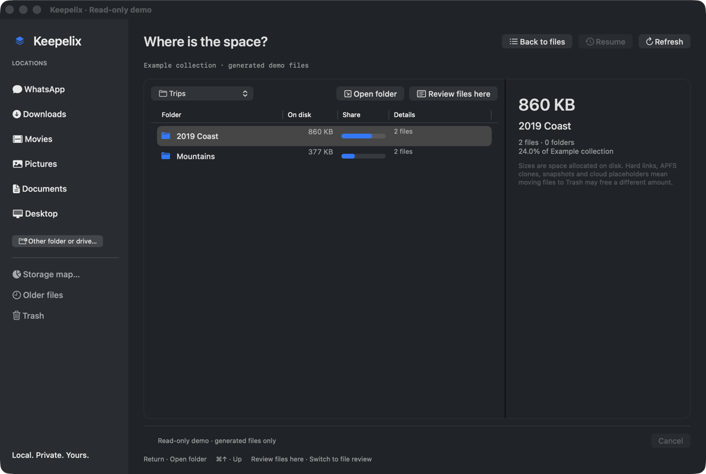
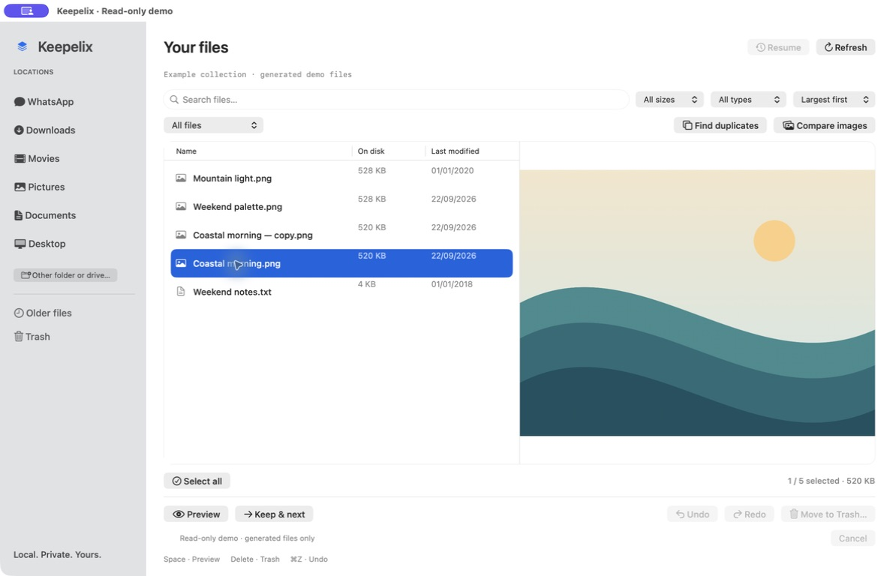
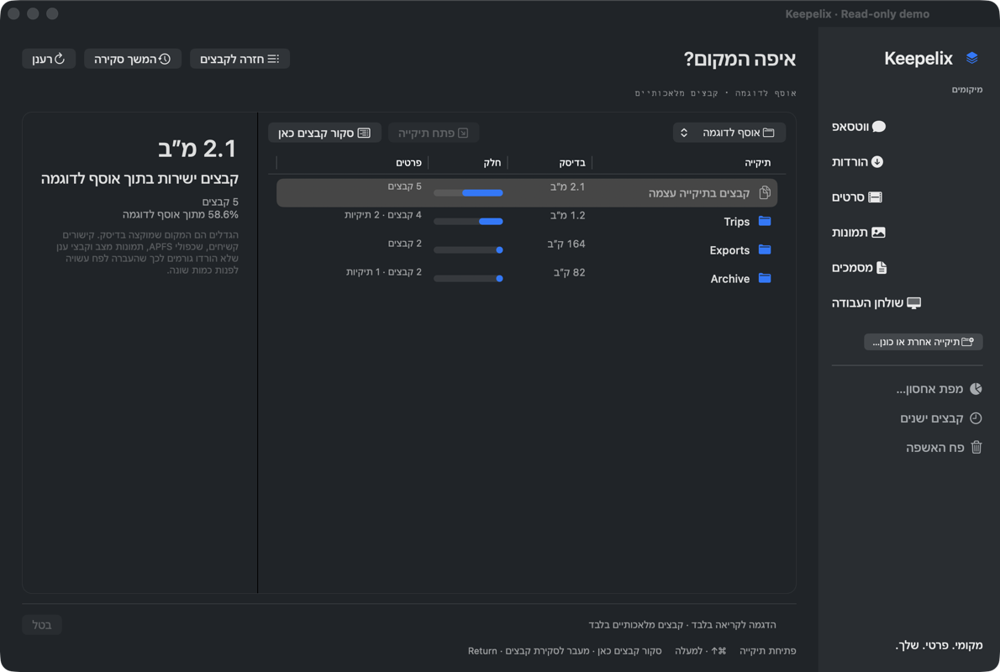
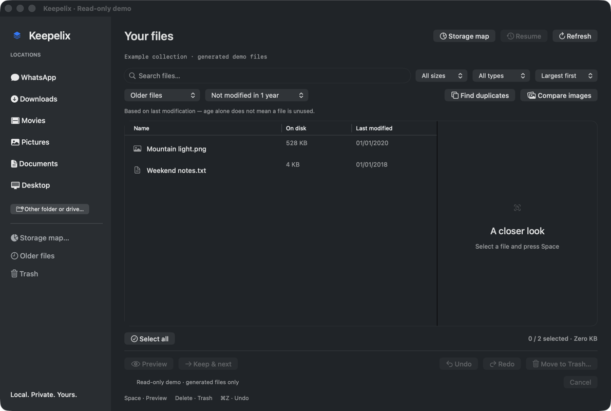

<p align="center"></p>

<p align="center">
  <a href="https://github.com/danielsimisi-coder/keepelix/actions/workflows/ci.yml"></a>
  
  <a href="LICENSE"></a>
  
</p>

<p align="center"><strong>See what fills your Mac. Review it with your eyes and your keyboard.</strong><br>Map a folder or drive. Open the folder that takes the space. Preview each file. Keep it or move it to Trash. Continue.</p>

<p align="center"><a href="https://github.com/danielsimisi-coder/keepelix/releases">Releases</a> · <a href="docs/DISTRIBUTION.md">Build from source</a> · <a href="docs/PRIVACY.md">Privacy</a> · <a href="docs/SAFETY.md">Safety</a></p>

## Your Mac is full. But full of what?

Keepelix was born from a recurring frustration: **storage keeps filling up, you do not know where the space has gone, and the Mac’s built-in tools do not give you a clear, convenient way to work through the problem.**

A storage total tells you that you have a problem. A folder full of unfamiliar filenames still leaves the hard part: finding the large files, seeing what they actually contain, and deciding what you can let go of without losing something important.

The first pile we tackled was accumulated WhatsApp media: old videos, repeated images and forgotten attachments mixed with useful files and client material. But WhatsApp was one example of the broader problem. Downloads, Movies and external drives can build up the same way.

Keepelix makes the review practical. Choose a folder or drive, sort by size, and work through the files: **Space to preview, Delete to move to Trash, ↓ to continue.** Older-file filters and duplicate suggestions help narrow the pile; Undo helps recover from a mistaken move. You decide what matters.

**No WhatsApp account connection. No cloud analysis. No automatic permanent deletion.** Keepelix reviews your chosen location; it does not read conversations or identify client files.

In one sentence: Keepelix is a Mac app that helps you free up space by showing what is actually filling your computer, from WhatsApp media to Downloads, Movies and external drives, so you can see it and decide what stays.

## Where is the space?

Click **Storage map** in the sidebar and choose a folder or a drive (your home folder is a good start). Keepelix measures every folder below it and lists them largest first, with a share bar and notes. Open a folder to go deeper; press **Review files here** to switch to the file review of that folder, sorted by size. **Back to files** returns to the list, and **Storage map** in the header jumps back to the map at the folder you are reviewing, without measuring again.

The map is read-only. It never moves anything; Delete does nothing there. It reports what it could not measure instead of guessing:

- **Not accessible** folders (permissions or protected locations) are listed with a lock and counted separately.
- **Bundles** such as apps and photo libraries are measured but not opened file by file.
- **Hidden** folders are shown, because system and app data often live there. Review them with care.
- **Cloud placeholders** that are not downloaded take no local space and are counted separately.
- Symbolic links are not followed, other volumes mounted below the folder are not entered, and hard-linked data is counted once.
- You can cancel a long measurement and keep the partial totals; the map says they are partial.

Sizes are space allocated on disk. Hard links, APFS clones, snapshots and cloud placeholders mean that moving files to Trash may free a different amount, and Trash itself is not free space until you empty it.

**What about “Other” or “System Data”?** macOS puts caches, app data, backups and hidden Library folders into that bucket. Keepelix does not delete it for you. Map your home folder and the hidden folders appear with their real sizes, so you can see what is in there and review the files you recognise. Protected system folders are reported as not accessible rather than guessed.



Videos in mp4, m4v or mov open in an inline player with controls that stay visible; other formats use Quick Look. The badge next to the path shows the type, image pixel size or video length, and the counter shows which item is highlighted out of the list.


The same app in Hebrew, mirrored right-to-left, chosen from the Language menu:



## What it does

| Review | Compare | Stay in control |
|---|---|---|
| Storage map of any folder or drive, largest folders first | SHA-256 exact-copy groups | Confirmed batch moves to macOS Trash |
| Space for Quick Look; videos play inline with always-visible controls | Side-by-side duplicate previews | Blocked restores wait for a retry and never overwrite |
| Type badge (image size, video length), path and "item N of M" for the selection | Loaded location highlighted in the sidebar | Delete does nothing in the map |
| Command/Shift multi-selection | Select extra copies while keeping one | Undo and redo batches during this session |
| Filter by name, type and size | Opt-in, local similar-image suggestions | Changed-file and path checks before each move |
| Right-click to reveal the original in Finder; drag rows out to Finder, WhatsApp or any window (copies) | Hidden, protected and bundle folders are labelled in the map | Progress, cancellation and per-file errors |
| WhatsApp media filter: group chats, personal chats, status (by folder name only) | | |
| Explicit resume of your last folder and position | Hard links are not treated as extra copies | No private file inventory in the app bundle |

## Try the beta

**macOS 13 or later.** The release package contains a universal Apple Silicon + Intel app.

1. Get the ZIP from [Releases](https://github.com/danielsimisi-coder/keepelix/releases), extract it, and open Keepelix.
2. Click **Storage map** to see which folders fill a folder or drive, then **Review files here**. Or click **WhatsApp**, **Downloads**, **Movies**, **Pictures**, **Documents** or **Desktop**, or choose **Other folder or drive**. Each scans only the selected location. WhatsApp checks its local media folder on click and offers a folder picker if unavailable; no account connection is needed. Pictures skips Photos library packages.
3. Select a row; the preview is open by default. **Space** plays or pauses a video. Use **↓** or **Keep & next** to continue. Clicking a location that is already loaded shows it again without rescanning; **Refresh** rescans.
4. Use **⌘-click** or **Shift-click** to select several files. The count and size are shown before you confirm **Move to Trash**.

**Signing status:** the initial private beta is ad-hoc signed, **not Apple-notarized**. Gatekeeper may block a downloaded build. Do not disable Gatekeeper; building from source is the alternative until a Developer ID-signed, notarized release is available. See [distribution instructions](docs/DISTRIBUTION.md).

## Keyboard controls

| Key | Action |
|---|---|
| `Space` | Play or pause a video; otherwise toggle the preview (open by default) |
| `↑` / `↓` | Move through the list |
| `⌘` + click | Add or remove a file from the selection |
| `Shift` + click | Select a range |
| `⌘A` | Select the filtered list; in search text, select the text |
| `Delete` / `⌘⌫` | Move selected files to Trash (confirmation enabled by default) |
| `⌘Z` | Restore the latest Trash batch from this app session |
| `⇧⌘Z` | Redo the last restored batch with fresh safety checks |
| Right-click | Reveal the clicked original in Finder |
| `Return` or `⌘↓` (map) | Open the selected folder in the storage map |
| `⌘↑` (map) | Go up one folder in the storage map |

## WhatsApp: groups and personal chats

WhatsApp for Mac keeps each chat's media in a folder named after the chat identifier. When such folders are in the scanned location, a **chat filter** appears: group chats, personal chats, or status and broadcasts. This uses only the folder names. Keepelix never reads the chat database, so contact and group names are not available; the folder identifier is what you see. The storage map labels these folders the same way.

## Drag files out

Drag one or more highlighted rows to a Finder window, a WhatsApp conversation or any app that accepts files. The drag hands over the file location as a copy; Keepelix does not move or delete anything through a drag.

## Exact is different from similar

**Exact duplicates** have matching SHA-256 content hashes. “Select extra copies” leaves one deterministic keeper per group and checks it again before moving the selected extras. You can inspect every selection before confirming.

**Similar images** use a local visual difference hash and an aspect-ratio check. They may be resized exports, near-identical frames, or unrelated pictures that happen to resemble one another. Results are **review suggestions**, never automatically selected for removal. Rotated, cropped or very different edits may be missed.

“All groups” is useful for an overview; choose a group in the picker for focused side-by-side review.

## Before you move files

- **Save important files elsewhere first.** Keepelix is not a backup tool.
- **Close the owning app** before deleting its media. Removing WhatsApp or another application's files can leave missing attachments; future re-download is not guaranteed.
- **Downloaded cloud files may sync deletions.** Undownloaded placeholders are skipped, but that does not make downloaded cloud content disposable.
- **Trash is not free space yet.** Empty it yourself only after reviewing what you removed.
- **Undo is session-scoped.** After quitting, restore items through Finder Trash. Restores never overwrite an existing destination.
- **A blocked restore does not block the rest.** If a file already occupies the original path, that item stays in Trash and waits under **Retry restore**; earlier batches remain available with Undo. Quitting with items waiting asks first.

The app does not read chat databases or identify clients. It is an independent file tool, not affiliated with WhatsApp or Meta. Read the full [safety limits](docs/SAFETY.md).

## Build and test

No third-party dependencies. Requires Swift 5.9+ and macOS development tools.

```sh
git clone https://github.com/danielsimisi-coder/keepelix.git
cd keepelix
swift test
swift run Keepelix
```

Package a universal app:

```sh
./scripts/build-app.sh
```

Tests use disposable, generated fixtures. They exercise root boundaries, stale files, symlink replacement, duplicate selection, hard links, cancellation, partial Trash failures, restore conflicts and image similarity. CI also builds the release target and checks the tracked source for accidental private payloads.

## Project layout

```text
Sources/Keepelix/       Native AppKit interface and Quick Look
Sources/KeepelixCore/   Scanning, duplicate analysis, Trash and restore
Tests/                   Synthetic filesystem acceptance tests
scripts/                 Packaging and source privacy checks
docs/                    Privacy, safety, release and contributor guidance
```

## Status and contribution

This is beta 5. Code compilation and automated tests are not substitutes for testing on every macOS version. The Intel slice is cross-built; real Intel-machine verification and clean-Mac Gatekeeper verification are release checklist items, not implied claims.

The interface is English by default. **Keepelix › Language › עברית** switches the whole app to Hebrew with right-to-left layout on the next launch (the choice is stored for this app only). Contributions to accessibility, localisation and synthetic-fixture coverage are welcome. See [CONTRIBUTING](CONTRIBUTING.md), [SECURITY](SECURITY.md), and [CHANGELOG](CHANGELOG.md).

Released under the [MIT License](LICENSE). Built to help people decide what to keep.

## Author and contact

© 2026 **Daniel Siman Tov**. Contact: [daniel.simisi@gmail.com](mailto:daniel.simisi@gmail.com).

Keepelix is available under the [MIT License](LICENSE).

## Review older files

Choose a folder, then **Older files** in the sidebar. Filter files not modified in 6 months, 1 year, 2 years or 5 years. Sort by largest, smallest, oldest, newest or name; the Name, On disk and Last modified column headers also sort the list. Switching review views clears selection.

“Old” means last modified before the selected cutoff. It does not mean you have not opened the file, and it never means the file is safe to delete automatically. The view remains limited to your chosen folder. The **Trash** shortcut opens your user Trash folder in Finder.

The Trash confirmation offers **Do not show again**. Re-enable it from **Keepelix → Confirm before Trash**. Undo and Redo also have buttons; successful actions update the status without extra popups. History lasts only for the current session.



Screenshots show the real app using generated, read-only demo files.

Undo/Redo history is separate for each chosen folder during the session. Switching folders cannot replay an action in the previous folder; return to that folder to access its history. If a restore is blocked because another file now occupies the original path or the Trash item changed, the item stays in Trash and waits under **Retry restore**. Undo continues to earlier batches meanwhile. Resolve the conflict and retry, or restore through Finder Trash.
